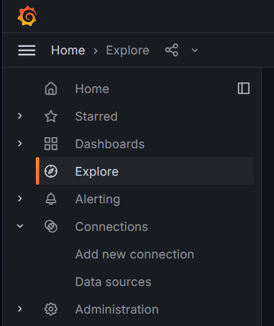
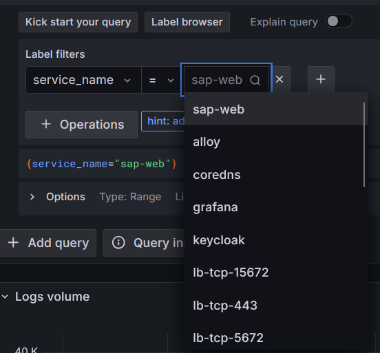
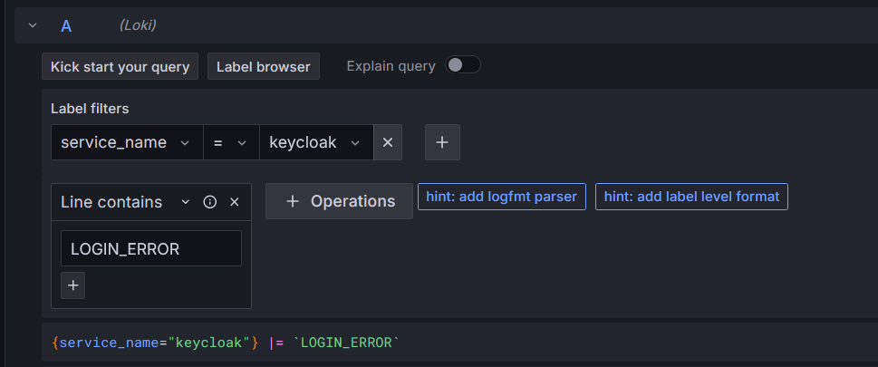

# Grafana logging

To access the user-facing logging application (Grafana) in your browser, go to the /grafana/ page. For example in the production enviroment this would be https://sofi-platform.dk/grafana/.

## Log exploration
The usual way to access logs in grafana is the expore page, which can be accces by to clicking the `Explore` menu on the left side.

The expore page contains 2 main components, the `query builder` and the `data` section.

The `data` sections contains the logs that are found by the query in the `query builder`.

A query must contain at least 1 label filter and a time range. By default the selected time range is only 1 hour, which can be changed by clicking the `Last 1 hour` dropdown.

### Label filters
Next, a label filter must be chosen. Each log logged by the different applications have a set of label/value pairs attached to it. For example, all logs logged by the `sap-web` service has the label/value pair `service_name=sap-web`. Each application in the project has it's own `service_name`, and can be found when selecting the `service_name` label. 

There are other userful labels, such as `cluster` which only has a single value, namely the name of the enviroment (`dev`, `test` or `prod`) which can be used to search all the logs in the project at once. The `instance` label can be used to search a specific instance of an application, which is useful since a new instance is created when an application crashes, and as such we can search for logs only in the crashed instance, since we dont care about what happend after the restart.

### Operations
When more complex searches are needed, operations can be added to the query. For example the `Line contains` filter operation filters away all logs which do not contain the text specified in the operation filter. For example, this can be used to search for "error" or "exception".

This example searches for all failed login attempts in the keykloak service.